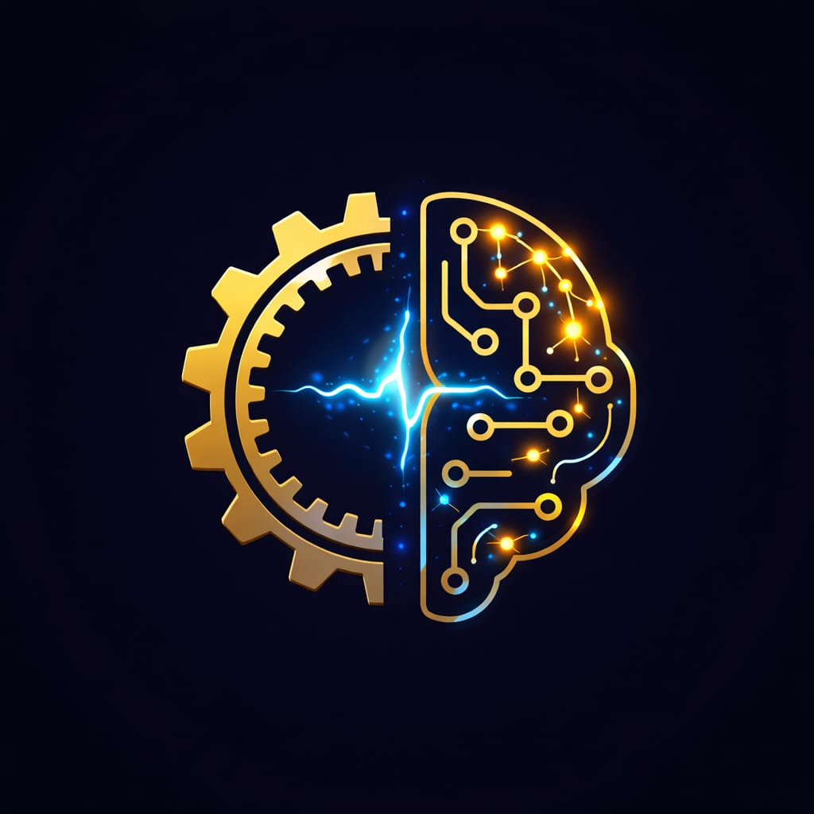

# Clankbrain

<p align="center"></p>

[](https://github.com/YehudaFrankel/clankbrain/releases) [](LICENSE) [](https://claude.ai/claude-code) [](https://github.com/YehudaFrankel/clankbrain/discussions)

**Claude Code forgets everything every session. Clankbrain makes it remember — and get better over time.**

Two commands. Everything else is automatic.

```
Start Session   ->  reads memory, applies past lessons, picks up where you left off
[work]
End Session     ->  extracts lessons, saves everything to memory
```

---

## Install

```bash
npx clankbrain
```

No API keys. No background service. No database. **Requires:** [Claude Code](https://claude.ai/claude-code)

---

## What changes after a few sessions

```
Start Session

Pulling from GitHub...
Already up to date.

Ready. Last change: Session 42 — Dashboard pagination fix (page state lost
on filter change, debounce added, loading spinner missing on slow queries).

What are we working on?
```

Claude already knows what changed last session, what was deferred, and what patterns to apply — before you type a word.

After 8 sessions:

```
=== Clankbrain Progress Report ===

  Sessions logged         8
  Lessons accumulated     14
  Known errors logged     6    <- never debugged twice
  Rejected approaches     9    <- never re-proposed
  Skill accuracy          78%

  -> 8 sessions in. Compounding is happening.
```

---

## Is this for you?

- You use **Claude Code** daily on a real, ongoing project
- You've felt the pain of re-explaining your codebase every session
- You're disciplined enough to run two commands: `Start Session` and `End Session`

If you're just experimenting with Claude Code, come back when it's your primary tool.

---

## Lite or Full?

Setup asks which mode fits your project.

| | Lite | Full |
|---|---|---|
| Setup | Zero dependencies | Python 3.7+ |
| Memory | 1 notes file | 5 typed memory files |
| Drift detection | None | Automated after every edit |
| Session journal | Not included | Auto-captured on every Stop |
| Best for | Quick experiments | Long-running codebases |

Not sure? Start with Lite. `Upgrade to Full` adds everything any time.

→ [Full comparison and upgrade steps](docs/architecture.md#full-vs-lite)

---

## What you get

- **Persistent memory** — decisions, bugs fixed, rejected approaches, codebase knowledge
- **Semantic memory search** — `/recall` finds related memories by meaning, not just keywords. Local model (~90MB, no API key, fully offline)
- **Skills that self-improve** — each skill scores itself; `/evolve` patches the ones that keep failing
- **Drift detection** — catches undocumented changes after every file edit
- **Regret guard** — scans past rejected approaches before every prompt, blocks re-proposing them
- **Progress reports** — real numbers built from your actual session history
- **Team sync** — share what you learn with your whole team. Manager runs `Setup Team` once, teammates run `Join Team` once, every Start Session pulls the latest silently. Personal memory stays local.

---

## What /recall looks like

Six months in, you hit an auth error. Type `/recall auth error`:

```
/recall auth error

Found 4 related memories:

  lessons.md [score: 0.91]
  "Admin endpoints return stat=fail when SessionID is missing —
   IGPlugin injects lowercase sessionid but isAdminSession() reads
   uppercase SessionID. Always pass it explicitly."

  error-lookup.md [score: 0.87]
  "stat=fail + 'Request failed' → missing SessionID in appAdmin* call.
   Fix: add SessionID: sessionStorage.getItem('adminSession') to every
   admin call."

  decisions.md [score: 0.74]
  "Settled: always pass SessionID explicitly. IGPlugin auto-injection
   does not satisfy the admin auth check — confirmed session 12."
```

Root cause, known fix, and settled decision — across three files, by meaning not keyword.

→ [Setup and commands](docs/commands.md#memory)

---

## global-lessons.md

One file, loaded at `Start Session` on every project. Good for things that are true everywhere:

```
- Always check .env before debugging auth issues
- Read the error message before searching Stack Overflow
- Never force-push to main — find the root cause instead
```

Lives at `~/.claude/global-lessons.md`. Clankbrain creates it on first install.

---

## Agents — multi-skill orchestrators

Skills handle one step. Agents chain several into a complete workflow with explicit **BREAKPOINT** markers at every decision point.

| Agent | Steps |
|-------|-------|
| `feature-build` | search-first → plan → implement → code-reviewer → verification-loop → /learn |
| `bug-fix` | reproduce → isolate → fix → verify → log+learn |
| `end-session` | /learn → update memory → drift check → STATUS.md → evolve → sync |

Claude stops at every `BREAKPOINT` and waits for your explicit "continue". Add your own in `.claude/agents/`.

→ [Full agent reference and breakpoint patterns](docs/agents.md)

---

## The habit is the product

Clankbrain compounds with use — but only if you use it. Run `Start Session` / `End Session` every session, `/evolve` every few weeks, and Claude gets measurably better at your specific codebase over time.

Tested across 160 real sessions on a production codebase. Not a demo project.

---

## Changelog

| Version | What changed |
|---------|-------------|
| v2.2 | Team sync merged into sync.py — one tool, one config; `join` command; health checks; 16 automated tests |
| v2.1 | Markdown agents with BREAKPOINT markers; path-scoped rule frontmatter; CLAUDE.md trimmed to <150 lines with Skill Map |
| v2.0 | Semantic memory search (`/recall`); compound learning (velocity tracker, skill scores); guard patterns; complexity scanner |
| v1.0 | Initial release — persistent memory, skills, lifecycle hooks, cross-machine sync |

---

## Go deeper

- [Every command](docs/commands.md)
- [Cross-machine sync and team sync](docs/sync.md)
- [Skills and the learning loop](docs/skills.md)
- [Agents and breakpoint patterns](docs/agents.md)
- [Rules — always-load vs. path-scoped](docs/rules.md)
- [Extending Clankbrain — skills, agents, rules](docs/extending.md)
- [Architecture, modes, and file tree](docs/architecture.md)
- [Lifecycle hooks](docs/hooks.md)
- [Other IDEs and install options](docs/other-ides.md) — Cursor, Windsurf, Warp, GitHub Copilot
- [FAQ](docs/faq.md)
- [Example memory files](examples/)

---

**Built by [Yehuda Frankel](https://github.com/YehudaFrankel).** Using it on a real project? [Tell us what you're building →](https://github.com/YehudaFrankel/clankbrain/discussions) — If it helped, [star it](https://github.com/YehudaFrankel/clankbrain).
