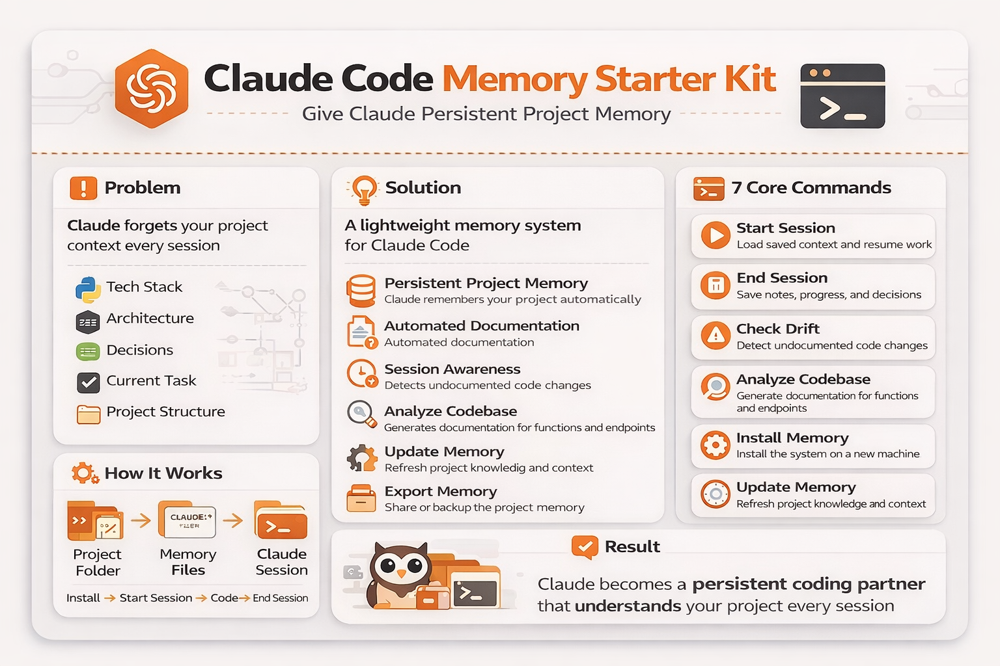

# Claude Code Memory Starter Kit



**Give Claude a permanent memory for your project — so it never forgets what you built, why you built it, or where you left off.**

---

## The Problem

Every time you close Claude Code and open it again, Claude starts completely fresh. It doesn't remember:

- What your project does
- Which files you've been working on
- Why you made certain decisions
- What bugs you just fixed
- Where you left off

So you spend the first 10 minutes of every session re-explaining your project. This kit fixes that permanently.

---

## The Fix — In Plain English

This kit gives Claude a "notebook" for your project. Every session, Claude reads its notes before you say a single word. It knows your project, your history, and what comes next.

**You type three words. Claude does the rest.**

```
Start Session
```

That's it. Claude reads everything, checks if anything changed while you were away, and tells you exactly where things stand.

---

## Get Started — 3 Steps

> Everything after Step 1 happens inside Claude Code chat. No terminal commands, no files to copy.

---

### Step 1 — Make sure Python is installed

Open a terminal and run:

```bash
python --version
```

**See a version number?** You're good. Skip to Step 2.

**Nothing happens?** Go to [python.org/downloads](https://python.org/downloads), install Python, and check **"Add Python to PATH"** during install. Then come back.

> Python is only needed once for setup. You'll never need to touch it again after that.

---

### Step 2 — Open your project in Claude Code

In your terminal, navigate to your project folder and start Claude Code:

```bash
cd your-project-folder
claude
```

> If Claude Code isn't installed yet: `npm install -g @anthropic/claude-code` — then run `claude` to sign in.

---

### Step 3 — Type this in the Claude Code chat

```
Setup Memory
```

Claude will ask you a few simple questions (project name, tech stack), then set everything up automatically. Takes about 2 minutes.

**That's it. You're done.**

---

## Your Daily Routine

```
Open Claude Code
      ↓
Type "Start Session"
→ Claude reads its memory, checks your files, and tells you where things stand
      ↓
Work on your project as normal
→ Claude updates its notes automatically after every change
      ↓
Type "End Session"
→ Claude saves everything, logs the session, and confirms memory is clean
```

You don't have to think about memory — it runs in the background automatically.

---

## Every Command

Type any of these in Claude Code chat:

### Daily use

| Command | What it does |
|---------|-------------|
| `Start Session` | Claude reads its memory and tells you where things stand |
| `End Session` | Save everything, log the session, confirm memory is clean |

### Setup and maintenance

| Command | What it does |
|---------|-------------|
| `Setup Memory` | First time only — creates all the memory files for your project |
| `Install Memory` | New computer — rebuilds Claude's memory from your existing files |
| `Update Kit` | Pull the latest version of this kit safely (your files are never touched) |
| `Update Kit from [URL]` | Update from a specific fork or branch |

### Understanding your project

| Command | What it does |
|---------|-------------|
| `Analyze Codebase` | Claude scans all your files and documents what it finds |
| `Check Drift` | Did code change that Claude doesn't know about yet? This finds it |
| `Code Health` | Scan for leftover debug code, hardcoded values, missing error handling, dead code |

### Planning and fixing

| Command | What it does |
|---------|-------------|
| `Estimate: [task]` | Before starting anything — get a complexity rating, risk flags, and a plan |
| `Debug Session` | Structured bug fix: reproduce → isolate → hypothesize → fix → verify → log |
| `Handoff` | Generate a HANDOFF.md file — everything someone new needs to pick this up |

### Skills (auto-invoked)

| What you say | What Claude does |
|-------------|-----------------|
| `"review this file"` | Full code review — dead code, missing error handling, convention violations |
| `"check for security issues"` | SQL injection, missing auth, sensitive data exposure |
| `"fix the bug where..."` | Structured diagnosis — root cause first, fix second |
| `"add a feature that..."` | Plan → confirm → implement → update memory |
| `"is this ready for prod"` | Environment check — finds hardcoded dev values, runs deploy checklist |
| `"verify this works"` | Walks through your test checklist layer by layer |
| `"refactor this"` | Clean up structure without changing behavior — plan first, change second |

---

## What Gets Created

After running `Setup Memory`, your project will have:

```
your-project/
├── CLAUDE.md                        ← Claude reads this before every session
├── STATUS.md                        ← Session log (date + what changed each session)
├── update.py                        ← Safe kit updater
├── tasks/                           ← Commit this folder to your repo
│   ├── todo.md                      ← Claude writes plans here before touching code
│   ├── lessons.md                   ← Every correction logged — read every session start
│   ├── decisions.md                 ← Why things were built the way they were
│   └── errors.md                    ← Bugs fixed, root causes, fixes applied
├── tools/
│   └── check_memory.py              ← Runs automatically after every file edit
└── .claude/
    ├── settings.json                ← Auto-runs drift check after every save
    ├── memory/
    │   ├── MEMORY.md                ← Index — auto-loaded every session
    │   ├── project_status.md        ← What's built, what's not, key decisions
    │   ├── js_functions.md          ← Every JS function documented
    │   ├── html_css_reference.md    ← Every HTML section and CSS class
    │   ├── backend_reference.md     ← Every API endpoint and DB pattern
    │   └── user_preferences.md      ← How you like Claude to work
    └── skills/
        ├── code-review/
        ├── security-check/
        ├── fix-bug/
        ├── new-feature/
        ├── environment-check/
        │   ├── SKILL.md
        │   └── ENVIRONMENT-MATRIX.md   ← fill in dev vs prod values
        ├── run-verification/
        │   ├── SKILL.md
        │   └── TEST-STRATEGY.md        ← fill in your test checklists
        └── refactor/
            ├── SKILL.md
            └── ANTI-PATTERNS.md        ← fill in project-specific patterns
```

---

## If Something Goes Wrong

### Claude Code crashed mid-session

No problem. Everything is saved to disk — a crashed session never corrupts your memory files.

1. Open a new session
2. Type `Start Session`
3. Claude reads memory and picks up where you left off

### Something feels off — Claude seems confused

Type `Check Drift` — this scans your actual code against Claude's memory and tells you if anything got out of sync. It then fixes it.

### Moved to a new computer

Type `Install Memory` — Claude scans your project, rebuilds its notes, and you're back to normal.

---

## Advanced Features

### Skills — Claude acts automatically based on context

Skills are instruction packs that fire automatically when the situation matches. You don't invoke them manually — you just describe what you want in plain English and Claude recognizes the situation.

**Build a starter set automatically:**
```
Generate Skills
```
Claude scans your tech stack and creates skills tailored to your project — a project with a database gets a `write-query` skill, a project with a deployment step gets `environment-check`, etc.

**Build a custom skill:**
```
Create a skill called [name] that [describe what it does]
```

**Or write one manually** — create `.claude/skills/my-skill/SKILL.md`:
```
---
name: my-skill
description: When to trigger this skill (the situation Claude should recognize)
allowed-tools: Read, Edit, Grep, Glob, Bash
---

Step-by-step instructions here.
```

Skills can also include supporting reference docs in the same folder — like `ANTI-PATTERNS.md` or `ENVIRONMENT-MATRIX.md` — that the skill reads when it runs.

---

### The four task files

These four files build up over time and make Claude smarter about your specific project:

| File | What it stores | Why it matters |
|------|---------------|---------------|
| `tasks/todo.md` | Plans written before touching code | You always know what Claude is doing and why |
| `tasks/lessons.md` | Every correction Claude receives | Same mistake never happens twice |
| `tasks/decisions.md` | Architectural choices and the reasons behind them | Stops Claude re-debating settled questions |
| `tasks/errors.md` | Bugs fixed, root causes, fixes applied | Claude knows the history of every bug |

Claude reads all four at the start of every session. The longer you use the kit, the more context Claude has.

---

### Drift detection — automatic memory sync

After every file edit, a script called `check_memory.py` runs silently in the background. It compares your actual code against Claude's memory files and flags anything that got out of sync — functions added but not documented, classes removed but still in memory.

You don't have to think about this. It just runs. If it finds something, it tells Claude. If everything is clean, it says nothing.

Run it manually anytime:
```
Check Drift
```

---

### Headless mode — run Claude in the background

For large refactors, scaffolding, or multi-file tasks where you don't need to watch every step:

```bash
claude --headless "your full task description here"
```

Claude runs the whole task autonomously and returns when done. Best for big, well-defined jobs. For anything that needs back-and-forth, use normal interactive mode.

---

### Updating the kit

```
Update Kit
```

The updater shows you exactly what will change and asks for confirmation before touching anything. Your memory files, `STATUS.md`, and all your project-specific content are **never touched**. Only the kit's command definitions get updated.

Want to pull from a fork or specific branch?
```
Update Kit from https://github.com/your-fork/repo
```

---

### Using with a team

The memory files are plain markdown — they commit to your repo just like any other doc.

**What to commit:**
```bash
git add .claude/memory/
git add tasks/
git commit -m "Update Claude memory and task files"
```

**Merge conflicts are simple:** Memory files are append-only tables. If two people add rows at the same time, keep both rows — no logic to untangle.

**Handoff between team members:**
```
Handoff
```
Generates `HANDOFF.md` with current state, next 3 tasks, key decisions already made, known bugs and fixes, and gotchas for someone new. Don't commit it — it's a point-in-time snapshot.

---

### Two setup modes

When you run `Setup Memory`, you can choose:

| | Full | Lite |
|---|---|---|
| Memory files | 5 separate files by topic | 1 simple notes file |
| Drift detection | Auto-runs after every file edit | Manual or none |
| Best for | Multi-file projects with backend + frontend | Small scripts, single-file projects |
| Can upgrade later? | — | Yes, one prompt |

Not sure which to pick? Choose Full. You can always trim it later.

---

## Requirements

- [Claude Code](https://claude.ai/claude-code) — installed and authenticated
- Python 3.7 or newer — free at [python.org/downloads](https://python.org/downloads)
- Nothing else

---

## No Terminal? Paste This Instead

If you'd rather skip `setup.py` entirely, paste one of these directly into Claude Code chat:

**Option A — Claude asks you questions (recommended):**
> Set up the Claude memory system for this project. Ask me: project name, tech stack, which JS files to track, which CSS files to track, and CSS class prefix. Then create CLAUDE.md, STATUS.md, and the .claude/memory/ files.

**Option B — Tell Claude everything at once:**
> Bootstrap memory for this project. Project name: [name]. Tech stack: [e.g. Node.js + React]. JS files: [e.g. js/app.js]. Create all memory files now.

**Option C — Blank templates:**
> Create a blank Claude memory system: CLAUDE.md, STATUS.md, .claude/memory/MEMORY.md, project_status.md, js_functions.md, html_css_reference.md, backend_reference.md, user_preferences.md. Leave them as templates I'll fill in.

**Option D — Claude figures it all out:**
> Analyze this codebase and set up the Claude memory system automatically. Scan all JS, CSS, and backend files. Document all functions, classes, and endpoints. Create CLAUDE.md, STATUS.md, and .claude/memory/ files pre-filled with what you find.

**Option E — Lite setup (small projects):**
> Set up a simple Claude memory system for this project. Create just: CLAUDE.md (with Start Session, End Session, auto-save rules), STATUS.md (session log), and .claude/memory/notes.md (one file for functions, decisions, gotchas).

---

> Built over 84 real development sessions. The drift detector found 21 undocumented functions the first time it ran. Skills were added after noticing the same prompts getting copy-pasted every day. Everything here came from actual use.

**GitHub:** [YehudaFrankel/Claude-Code-memory-starter-kit](https://github.com/YehudaFrankel/Claude-Code-memory-starter-kit)
